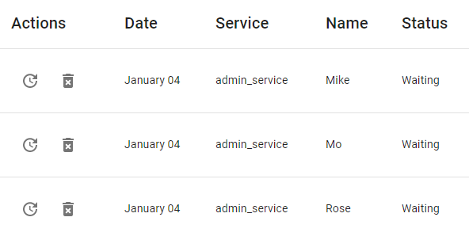
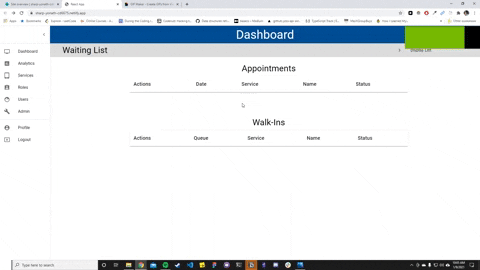
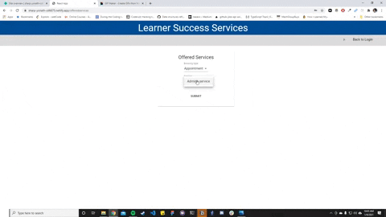
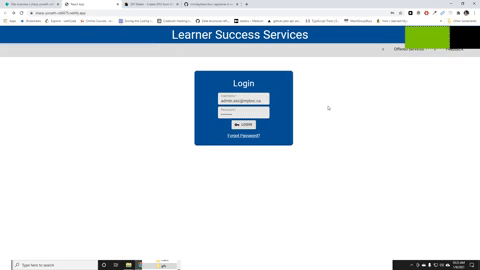

# bvc-capstone

## Contents

- [Vinci's Contributions](#contributions)
  - [Scheduler](#scheduler)
  - [Appointments Queue](<#appointments\queue>)
- [Demo](#demo)
- [Credits](#credits)

**Live version**: https://sharp-yonath-cd6675.netlify.app/

# Vinci's Contributions

## Scheduler

## Appointments Queue

# Demo

## Select a service

## Set up appointment info

## Fill out student form and set appointment

## Your appointment has been set!

# Credits
- **Dipti Gogoi**: Front-end developer
- **[@Dylandbl](https://github.com/Dylandbl)**: Front-end developer
- **Emmanuel Manarang**: Front-end developer, back-end developer
- **Ismael Mamorisoa**: Front-end developer
- **Sarah Dion**: Front-end developer
- **Vinci Taylaran**: Front-end developer, back-end developer
